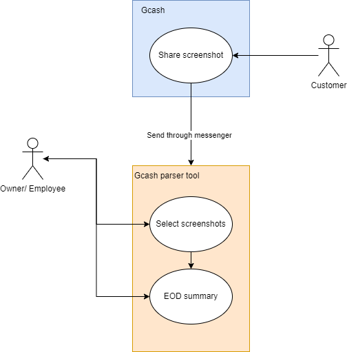
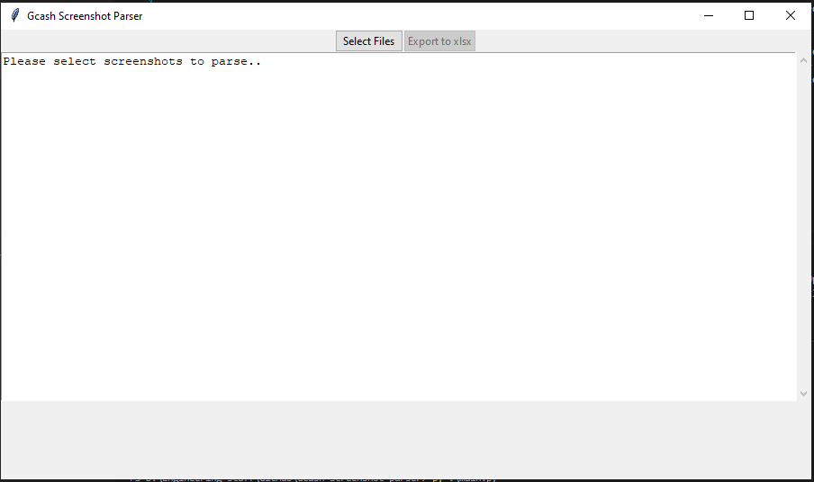
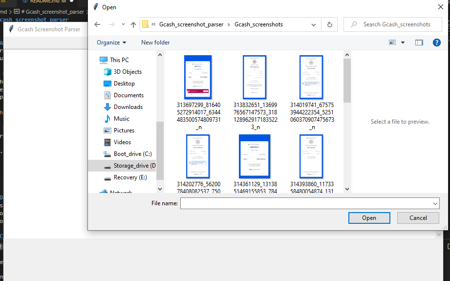
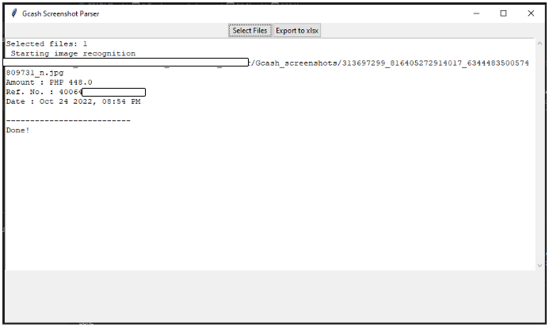
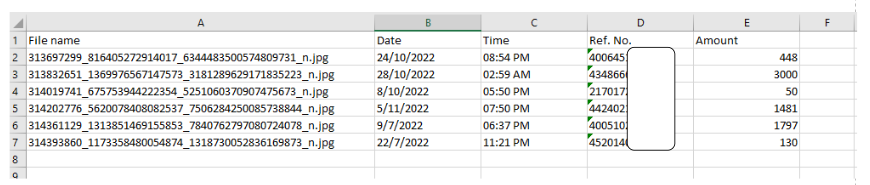

# Gcash_screenshot_parser


## About
A proof of concept aimed at automating retrieval of key information in gcash screenshots such as referrence number,
amount tendered and date and time. Additionally the user is able to export these to and xlsx file (only supported file format so far)

### Use case
Although there are many other ways of obtaining such key information without going through OCR, this tool is intended for small business owners or establishments who have to rely on using screenshots/photos or manually writing on a notebook as their main mode of book keeping. Hopefully, it should reduce the work load at the end of the work day when one has to go through the sales for the day.



### Usage
To run the tool you may simply run it on the terminal as so:
```
py .\main.py 
```

#### GUI
You should be greeted with the tkinter gui where you can select the screenshot files to parse.






After selecting a single/multiple files it will go ahead and parse it. When satisfied you can export this to .xlsx.




Please note that I've sensored my reference numbers for privacy reasons.

## Dependencies
This tool relies on the [tesseract OCR engine](https://github.com/tesseract-ocr/tesseract) that for the actual Optical Character recognition . I used [this](https://github.com/sirfz/tesserocr) python wrapper in particular for tesseract. Its important to note that you need to put this tessdata folder in the ./data since this is where I've pointed the engine to look. Lastly xlsxwriter was used to export things to .xlsx for use with excel.

## Change log
- 11/14/2022 : Initial release and minor bug fixes
- 11/24/2022 : Pointed path to tessdata to relative path in repo.
- 12/26/2022 : Started using dateutil parser to guess date formats

## To do
- Add better date string processing and error catching